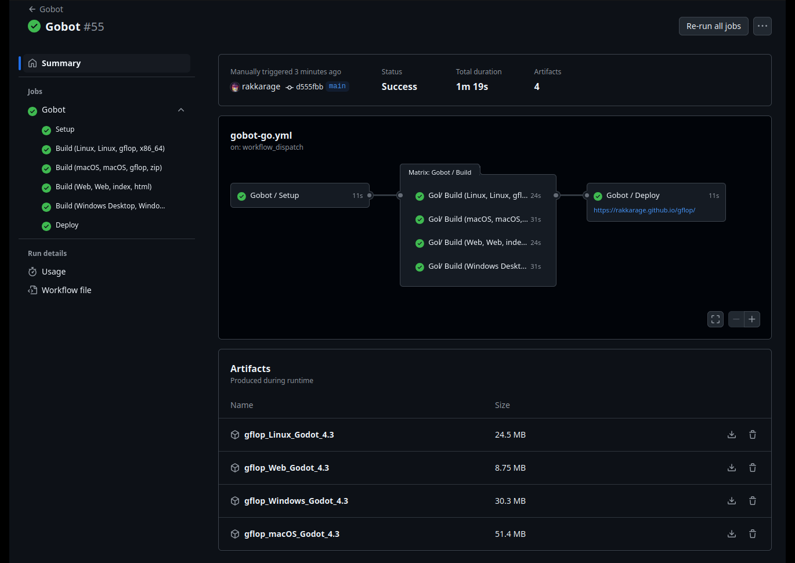
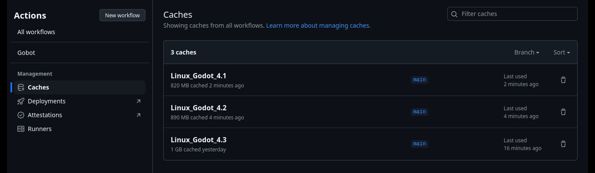

# auto

## Gobot&nbsp;🤖

This workflow is designed to automate the process of building and deploying Godot projects.

## Features

- Caches Godot and templates, so only downloads once.
- Parses build settings from `export_presets.cfg` to generates a custom strategy matrix to run all builds concurrently.
	- Do not need to set file names or paths just have
	the platform present in the file.
	- Will use your file and extension names if set. Except web which will use `index.htm` to deploy correctly.
- Optionally deletes old repository GitHub Pages deployments.
- Deploys web artifact to the repository GitHub Pages environment.

> [!WARNING]
> Old repository GitHub Pages deployments can be deleted.

## Workflow Overview

### Inputs

- `godot-version`: The version of Godot to be used in the build. This is required. Default: '4.3'
- `delete-old-pages`: Delete old Pages deployments or not. Default: 'false'

### Jobs

1. **Setup**
	- Cache Godot and Export Templates, and analyze input to generate a dynamic platform matrix.

3. **Build**
	- Export the project for each target platform concurrently.

5. **Deploy**
	- Deploy Web build to Pages after optionally deleting old Pages deployments.

## Usage

To use the workflow, call it from another workflow using (for example) the `workflow_call` event and provide the required inputs:

```yaml
name: Gobot
on:
  workflow_dispatch:
    inputs:
      godot-version:
        description: Godot Version
        default: '4.3'
      delete-old-pages:
        description: Delete Old Pages
        default: 'false'
permissions:
  pages: write
  id-token: write
  deployments: write
jobs:
  Gobot:
    uses: rakkarage/auto/.github/workflows/gobot.yml@main
    with:
      godot-version: ${{ github.event.inputs.godot-version }}
      delete-old-pages: ${{ github.event.inputs.delete-old-pages }}
```

## Screenshots




## Todo

- gen win icon with `rcedit`?
- cache project import files in .godot folder?
